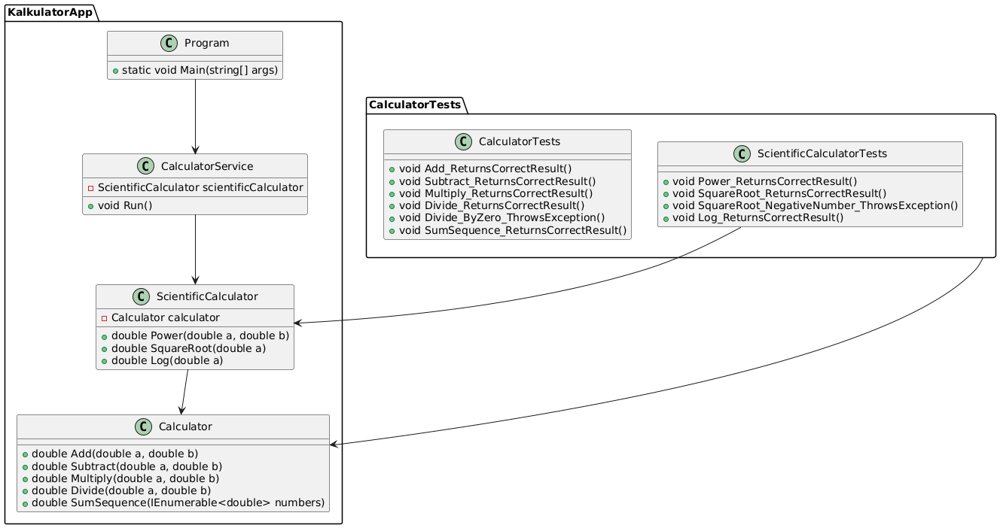

### **Zadanie programistyczne: Kalkulator naukowy w C# i .NET**

#### **Cel zadania**

Twoim zadaniem jest zaimplementowanie kalkulatora naukowego w języku **C#** z wykorzystaniem platformy **.NET**. Kalkulator powinien obsługiwać zarówno podstawowe operacje matematyczne, jak i bardziej zaawansowane funkcje naukowe. Dodatkowo, należy przygotować testy jednostkowe sprawdzające poprawność działania poszczególnych metod.

---

---

## **1. Wymagania funkcjonalne**

Kalkulator powinien obsługiwać następujące operacje:

### **Podstawowe operacje matematyczne:**

1. Dodawanie (`+`)
2. Odejmowanie (`-`)
3. Mnożenie (`*`)
4. Dzielenie (`/`) – z obsługą błędów, np. dzielenia przez zero

### **Operacje naukowe:**

5. Potęgowanie (`^`)
6. Pierwiastkowanie (`sqrt`) – tylko dla liczb nieujemnych
7. Logarytm naturalny (`log`)

### **Operacje na kolekcjach:**

8. Sumowanie wielu liczb (`sum`) podanych przez użytkownika jako lista oddzielona spacjami
9. Obliczanie średniej wartości (`avg`) z podanych liczb
10. Znalezienie wartości maksymalnej (`max`) i minimalnej (`min`) w zbiorze liczb

---

## **2. Wymagania niefunkcjonalne**

- **Podział na odpowiednie klasy:**
  - `Calculator` – obsługuje podstawowe operacje matematyczne
  - `ScientificCalculator` – zawiera instancję `Calculator` i obsługuje funkcje naukowe
  - `CalculatorService` – zajmuje się interakcją użytkownika
- **Obsługa błędnych danych wejściowych**
- **Testy jednostkowe dla każdej z metod obliczeniowych**

---

## **3. Struktura projektu**

### **📂 Kalkulator**

- `Program.cs` – punkt wejściowy aplikacji
- `Calculator.cs` – implementacja podstawowych operacji
- `ScientificCalculator.cs` – implementacja operacji naukowych przy użyciu `Calculator`
- `CalculatorService.cs` – zarządza interakcją z użytkownikiem

### **📂 Testy**

- `CalculatorTests.cs` – testy jednostkowe dla `Calculator`
- `ScientificCalculatorTests.cs` – testy jednostkowe dla `ScientificCalculator`

---

## **4. Przykładowa interakcja z użytkownikiem**

```
Kalkulator naukowy w C#
Wybierz operację: +, -, *, /, ^, sqrt, log, sum
> sum
Podaj liczby do sumowania, oddzielone spacją:
> 1.2 2.8 3.5 4
Suma: 11.5
```

```
Kalkulator naukowy w C#
Wybierz operację: +, -, *, /, ^, sqrt, log, log10, sum
> /
Podaj pierwszą liczbę:
> 10
Podaj drugą liczbę:
> 0
Błąd: Nie można dzielić przez zero.
```

---

## **5. Kryteria oceniania**

✅ **Kod spełnia wymagania funkcjonalne**\
✅ **Zastosowano odpowiedni podział na klasy i metody**\
✅ **Zastosowano kompozycję zamiast dziedziczenia**\
✅ **Obsłużono błędne dane wejściowe**\
✅ **Testy jednostkowe sprawdzają działanie każdej operacji**\
✅ **Kod jest czytelny i zgodny z dobrymi praktykami programowania**

**Powodzenia! 🚀**

